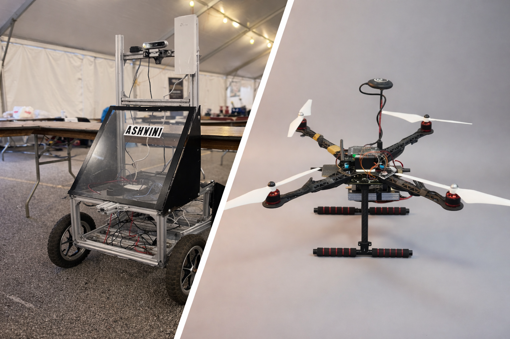
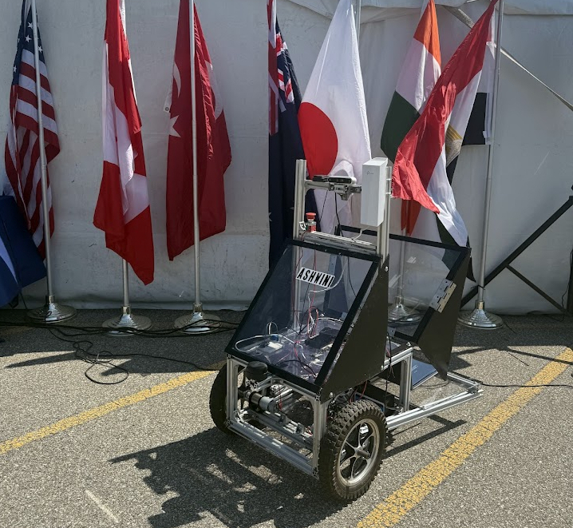

# Open House 2025 – Technology Showcase

## Overview

In **November 2025**, our college organized **Open House 2025**, an outreach event aimed at providing visiting **Class 12 students** with an opportunity to explore academic life, student-led projects, and hands-on engineering initiatives within the institution.

The event focused on introducing young learners to the **practical applications of science and technology**, while familiarizing them with the campus environment, laboratories, and student innovation culture.

As part of this event, our team showcased two major engineering projects:

- **Valkyrie Drone**
- **UGV Ashwini**

The Open House served as a platform to demonstrate **innovation, teamwork, and real-world engineering implementation** beyond classroom theory.

---

## Objectives of the Showcase

The primary objectives of participating in Open House 2025 were:

- To introduce school students to advanced engineering projects developed at the college  
- To demonstrate how classroom concepts translate into real-world engineering systems  
- To encourage curiosity and interest in **robotics, drones, and autonomous vehicles**  
- To provide mentorship and guidance to students interested in pursuing engineering careers  

---

## Showcase of Valkyrie Drone

During the Open House, the team formally presented **Valkyrie**, an indigenously developed drone platform, to the visiting students. This marked the **first academic showcase** of the drone to an external audience.

The presentation covered:

- Airframe design  
- Propulsion system  
- Flight controller and onboard electronics  
- Sensors and communication systems  
- Supporting software architecture  

The explanation was delivered in a **structured and student-friendly manner**, emphasizing how fundamental concepts of **physics, electronics, and programming** combine to enable stable and controlled flight.

The team also discussed real-world applications of drones, including:

- Surveying and mapping  
- Infrastructure inspection  
- Exploration and research  
- Environmental monitoring  

These examples helped students relate the project to practical use cases.

---

## Showcase of UGV Ashwini (IGVC 2025)

Alongside the aerial platform, the team also showcased **UGV Ashwini**, an unmanned ground vehicle developed for autonomous navigation challenges.

UGV Ashwini represented the college at the **International Ground Vehicle Competition (IGVC) 2025**, held at **Oakland University, Rochester, Michigan, USA**.

The UGV was presented with a focus on its **autonomous capabilities**, including:

- Obstacle detection  
- Path planning and navigation  
- Decision-making without human intervention  

Students were introduced to the role of **sensors, control algorithms, and system integration** in enabling autonomous ground vehicles. Participation in an international competition highlighted the **scale, seriousness, and professionalism** of student-driven engineering projects.

---

## Student Interaction and Q&A

One of the major highlights of the Open House was the **interactive question-and-answer session** between the team and the visiting students.

Class 12 students asked questions related to:

- How drones and autonomous vehicles work  
- Challenges faced during development  
- Skills required to build such systems  
- Pathways to pursue engineering and robotics  

Team members responded with **clear, simple explanations**, ensuring the discussion remained engaging, accessible, and inspiring. This interaction helped students gain insight into what engineering education involves **beyond textbooks**.

---

## Recognition and Appreciation

The team’s efforts and technical work were appreciated during the event.

- The **Vice Chancellor** commended the team for their innovation, teamwork, and contribution to promoting practical learning within the college.
- Our faculty advisor, **S. Indu**, appreciated the team’s dedication, technical depth, and effective communication with visiting students.

This recognition reinforced the importance of student-led initiatives in academic and outreach activities.

---

## Outcomes of the Open House Participation

- Successful first public academic showcase of the **Valkyrie Drone**
- Increased engagement and curiosity among visiting **Class 12 students**
- Effective demonstration of autonomous systems through **UGV Ashwini**
- Positive recognition from college leadership and faculty
- Strengthened outreach and mentoring impact of the student team

---

## Conclusion

**Open House 2025** was a meaningful and impactful experience for both the visiting students and the project team. By showcasing **Valkyrie** and **UGV Ashwini**, the team demonstrated practical engineering, inspired young learners, and represented the college’s culture of **innovation and hands-on learning**.

The event reinforced the importance of **outreach, mentorship, and student-driven projects** in shaping the next generation of engineers and technologists.

---

**UGV Tech Team – DTU**  
*Promoting Practical Engineering, Innovation, and Student Leadership*