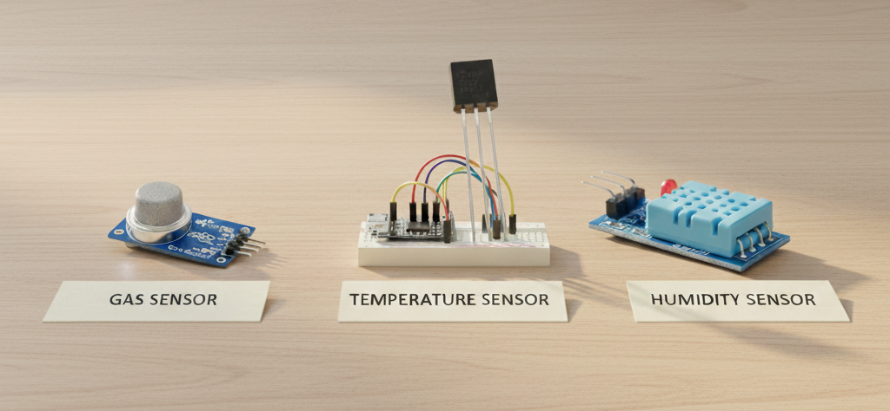

# Perception System of Valkyrie

## Introduction

**Valkyrie** is a manually operated unmanned aerial vehicle (UAV) designed with a strong emphasis on environmental awareness and situational sensing. While manual control ensures reliability and informed human decision-making, Valkyrie’s perception system significantly enhances the pilot’s understanding of the surrounding environment by collecting and processing real-time data from multiple onboard sensors.

The perception system acts as the *eyes and senses* of the drone, enabling it to observe environmental conditions, capture visual data, and transmit critical information to the ground station for monitoring and analysis.

---

## What is a Perception System?

In robotics and aerial platforms, a **perception system** refers to the combination of sensors, processing units, and communication modules that allow a system to sense and interpret its environment.

For Valkyrie, the perception system is designed to:

- Monitor environmental parameters  
- Capture real-time visual feedback  
- Transmit sensor data to the operator  
- Enable future integration with machine learning models  

This modular design ensures scalability for future autonomy and intelligence upgrades.

---

## Environmental Sensing Capabilities

### Temperature, Gas, and Humidity Sensors

Valkyrie is equipped with multiple environmental sensors that continuously measure:

- **Temperature**
- **Humidity**
- **Gas concentration**

These sensors allow the drone to gather valuable atmospheric data during flight, making it suitable for a wide range of real-world applications.

### Applications

Environmental sensor data collected by Valkyrie can be critical for:

- Environmental monitoring  
- Industrial inspection  
- Disaster response and hazardous area assessment  
- Research and data collection missions  

All sensor readings are transmitted **in real time** via the telemetry system, allowing operators to observe changing environmental conditions as the drone moves through different regions.

---

## Vision System

### FPV Camera for Real-Time Navigation

Valkyrie utilizes an **FPV (First Person View) camera** to provide live video feedback to the operator. This enables precise manual navigation and enhanced situational awareness, especially in complex or constrained environments.

### Imaging Camera for Data Capture

In addition to FPV, Valkyrie includes a dedicated imaging camera for:

- Capturing high-resolution images  
- Post-flight analysis  
- Visual inspection and documentation  

This **dual-camera architecture** separates navigation and data acquisition, improving both flight safety and data quality.

---

## Machine Learning Integration Potential

Although Valkyrie currently operates under manual control, its perception system is architected with **future machine learning integration** in mind.

By collecting structured sensor and visual data over time, machine learning models can be trained to:

- Detect abnormal gas levels  
- Predict hazardous zones  
- Classify environmental conditions  
- Correlate visual data with sensor readings  

This transforms Valkyrie from a simple aerial platform into a **data-generating intelligent system** capable of advanced analysis in future iterations.

---

## Conclusion

The perception system of Valkyrie transforms it from a manually operated drone into a **smart sensing platform**. By integrating environmental sensors, vision systems, and robust onboard computing, Valkyrie achieves real-time situational awareness and enables long-term data-driven intelligence.

As machine learning capabilities are integrated, the perception system will play a central role in enabling smarter decision-making, predictive analysis, and autonomous assistance—making Valkyrie a strong foundation for advanced aerial robotics research.

---

## Future Work

- Integration of onboard ML inference  
- Sensor fusion for enhanced perception accuracy  
- Autonomous decision-support features  
- Real-time anomaly detection  

---

**UGV Tech Team – DTU**  
*Advancing Autonomous Systems through Research and Innovation*# School Outreach Program – Robotics Awareness by Team UGV-DTU