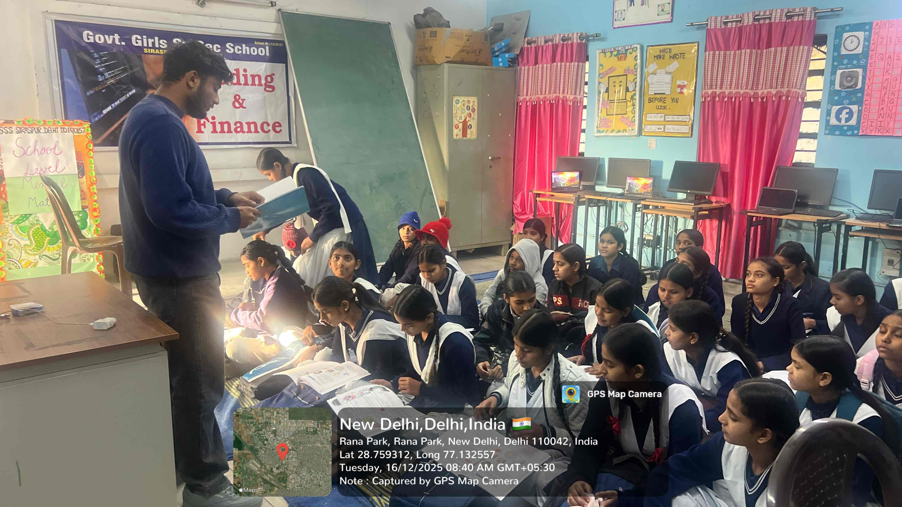
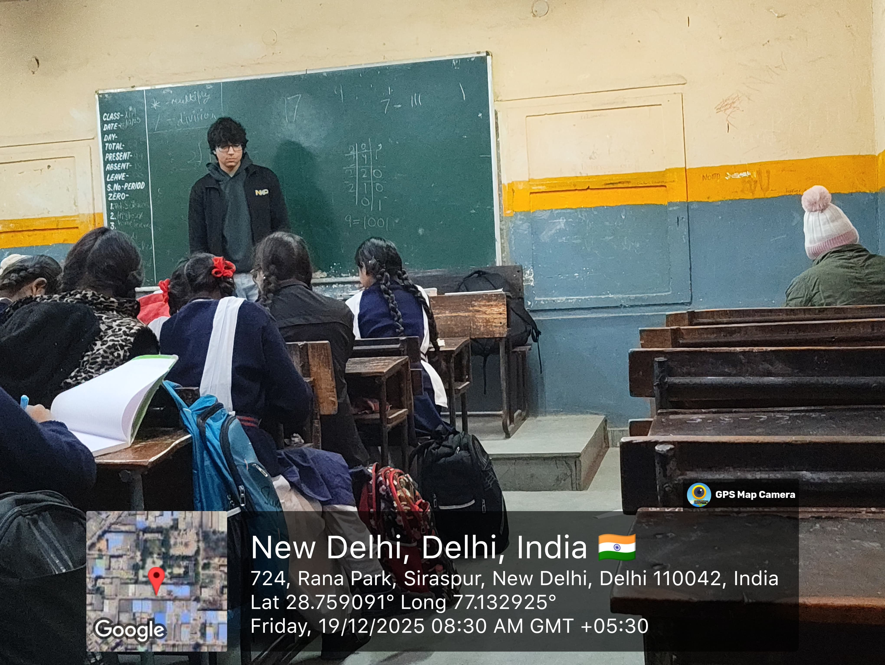
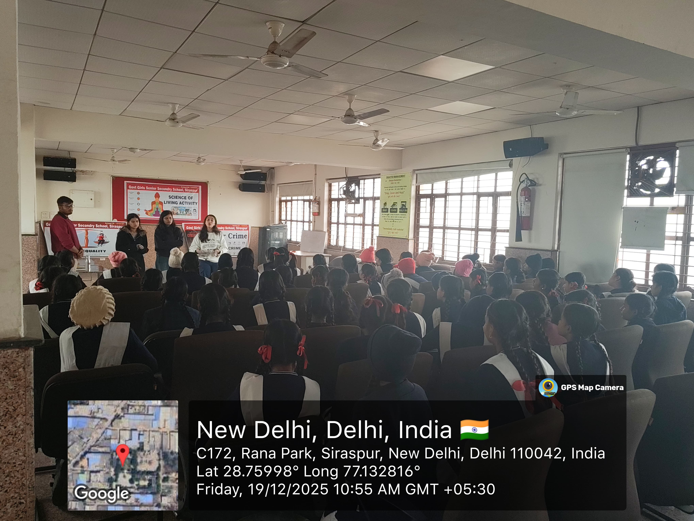

# School Outreach Program – Robotics Awareness by Team UGV-DTU

## Overview

As part of its outreach and mentoring initiatives, **Team UGV-DTU** conducted a school visit program aimed at introducing students to the fundamentals of robotics and technology. The program was organized at **GGSSS (Government Girls Senior Secondary School), Siraspur**, with the objective of creating awareness, building curiosity, and providing hands-on exposure to essential concepts in robotics and computing.

The sessions focused on two core areas—**Mechatronics** and **Programming**—and were designed to be interactive, engaging, and accessible to school students. Over the course of **three days**, the team worked closely with students from **Classes 9 and 10**, ensuring a balanced combination of conceptual understanding, practical exposure, and meaningful discussions.

---

## Objectives of the Visit

The key objectives of the school outreach program were:

- To introduce school students to the fundamentals of robotics and engineering  
- To explain the interdisciplinary nature of **Mechatronics**  
- To build basic **programming literacy** among students  
- To encourage confidence and participation among **girl students in STEM**  
- To create awareness regarding **social and digital issues**

---

## Day 1 Activities

The Day 1 sessions were led by **Vedant, Akshat, Navya, and Apeksha**. Students from Classes 9 and 10 were introduced to **Mechatronics**, with a clear explanation of how electronics, mechanics, and software work together in real-world systems.

In addition, fundamental programming concepts were covered, including **flowcharts, data types, variables, input-output mechanisms, and loops**. The session focused on building a strong foundational understanding through simple explanations and interactive discussion.

---

## Day 2 Activities

On Day 2, the sessions were conducted by **Vedant, Yuvraj, and Apeksha**. Students were introduced to **government-provided Mechatronics toolkits**, allowing them to gain practical insight into hardware components and their applications.

Practical **Scratch programming** sessions were conducted using the **Prime Book**, which enabled students to visually understand logic and programming flow. The hands-on nature of the session was particularly enjoyable and engaging for the students.

---

## Day 3 Activities

The final day involved the **full team**—**Vedant, Yuvraj, Apeksha, Navya, Daksh, Bhuvi, Lakshay, and Darshan**. The team assisted students in completing their **handbooks** and conducted dedicated sessions on **gender sensitisation** and **cyber crime awareness**.

These sessions aimed to complement technical learning with essential life skills, digital safety knowledge, and social awareness.

---

## Student Engagement and Impact

Students were highly curious, enthusiastic, and receptive throughout the program. The combination of technical learning, hands-on activities, and awareness sessions created a **meaningful and engaging learning experience**.

Students actively participated, asked thoughtful questions, and showed increased interest in robotics, programming, and technology-related fields.

---

## Conclusion

The visit to **GGSSS, Siraspur**, proved to be a rewarding and impactful outreach experience. The program successfully introduced students to core robotics concepts while reinforcing the importance of **inclusive STEM education, mentorship, and early exposure to technology**.

Such outreach initiatives play an important role in inspiring young minds and building confidence among students to explore engineering and technological careers.